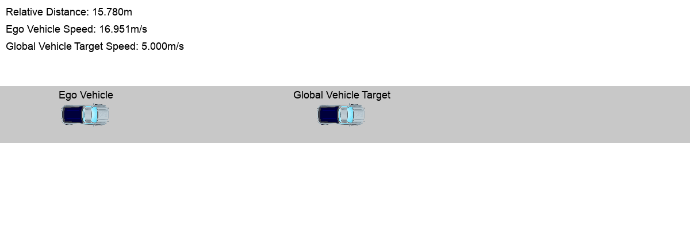

- [Experimental Results](#experimental-results)
  - [Application Validation](#application-validation)
  - [Reachable Sets with Cyberattacks](#reachable-sets-with-cyberattacks)
  - [Tool Error Comparisons](#tool-error-comparisons)
  - [Performance Comparison of Attack Strategy Search Algorithms](#performance-comparison-of-attack-strategy-search-algorithms)

### Experimental Results

#### Application Validation
In this section, we present the application validation results of the Flow* model in more detail. First, we give six initial state sets, as shown in Tab. 1.

<table>
    
    
    <caption>Tab. 1. Initial State Sets of Application Validation</caption>
    <thead>
        <tr>
            <th>Set</th>
            <th>Route</th>
            <th>Bound</th>
            <th>\(v_1\)</th>
            <th>\(v_2\)</th>
            <th>\(d_1\)</th>
            <th>\(d_2\)</th>
            <th>\(t\)</th>
            <th>\(d_r\)</th>
            <th>\(q\)</th>
        </tr>
    </thead>
    <tbody>
        <tr>
            <td rowspan="2">\(S_1\)</td>
            <td rowspan="2">\(q_1\)</td>            
            <td>min</td>
            <td>17.0</td>
            <td>15.0</td>
            <td>0.0</td>
            <td>120.0</td>
            <td>0.0</td>
            <td>120.0</td>
            <td>1</td>
        </tr>
        <tr>
            <td>max</td>
            <td>17.01</td>
            <td>15.0</td>
            <td>0.0</td>
            <td>120.0</td>
            <td>0.0</td>
            <td>120.0</td>
            <td>1</td>
        </tr>
        <tr>
            <td rowspan="2">\(S_2\)</td>
            <td rowspan="2">\(q_2\)</td>            
            <td>min</td>
            <td>17.0</td>
            <td>10.0</td>
            <td>0.0</td>
            <td>50.0</td>
            <td>0.0</td>
            <td>50.0</td>
            <td>1</td>
        </tr>
        <tr>
            <td>max</td>
            <td>17.01</td>
            <td>10.0</td>
            <td>0.0</td>
            <td>50.0</td>
            <td>0.0</td>
            <td>50.0</td>
            <td>1</td>
        </tr>
        <tr>
            <td rowspan="2">\(S_3\)</td>
            <td rowspan="2">\(q_1\) -> \(q_2\)</td>
            <td>min</td>
            <td>17.0</td>
            <td>5.0</td>
            <td>0.0</td>
            <td>80.0</td>
            <td>0.0</td>
            <td>80.0</td>
            <td>1</td>
        </tr>
        <tr>
            <td>max</td>
            <td>17.01</td>
            <td>5.0</td>
            <td>0.0</td>
            <td>80.0</td>
            <td>0.0</td>
            <td>80.0</td>
            <td>1</td>
        </tr>
        <tr>
            <td rowspan="2">\(S_4\)</td>
            <td rowspan="2">\(q_3\) -> \(q_4\)</td>
            <td>min</td>
            <td>17.0</td>
            <td>5.0</td>
            <td>0.0</td>
            <td>15.0</td>
            <td>0.0</td>
            <td>15.0</td>
            <td>1</td>
        </tr>
        <tr>
            <td>max</td>
            <td>17.01</td>
            <td>5.0</td>
            <td>0.0</td>
            <td>15.0</td>
            <td>0.0</td>
            <td>15.0</td>
            <td>1</td>
        </tr>
        <tr>
            <td rowspan="2">\(S_5\)</td>
            <td rowspan="2">\(q_3\) -> \(q_2\)</td>
            <td>min</td>
            <td>17.0</td>
            <td>6.8</td>
            <td>0.0</td>
            <td>19.0</td>
            <td>0.0</td>
            <td>19.0</td>
            <td>1</td>
        </tr>
        <tr>
            <td>max</td>
            <td>17.01</td>
            <td>6.8</td>
            <td>0.0</td>
            <td>19.0</td>
            <td>0.0</td>
            <td>19.0</td>
            <td>1</td>
        </tr>
        <tr>
            <td rowspan="2">\(S_6\)</td>
            <td rowspan="2">\(q_2\) -> \(q_3\)</td>
            <td>min</td>
            <td>17.0</td>
            <td>12.0</td>
            <td>0.0</td>
            <td>11.0</td>
            <td>0.0</td>
            <td>11.0</td>
            <td>1</td>
        </tr>
        <tr>
            <td>max</td>
            <td>17.01</td>
            <td>12.0</td>
            <td>0.0</td>
            <td>11.0</td>
            <td>0.0</td>
            <td>11.0</td>
            <td>1</td>
        </tr>
    </tbody>
</table>

Furthermore, based on the constructed Flow* model [normal.model](https://liuluddex.github.io/uploads/1D-ADAS-Verification/normal.model), the reachable sets under given initial state sets are solved, as shown in Fig. 1.



#### Reachable Sets with Cyberattacks

In this section, we will show more reachable sets corresponding to the initial state sets in Tab. 2, as shown in Fig. 2. 

<table>
    
    
    <caption>Tab. 2. Initial State Sets of Reachable Sets</caption>
    <thead>
        <tr>
            <th>Set</th>
            <th>Route</th>
            <th>Bound</th>
            <th>\(v_1\)</th>
            <th>\(v_2\)</th>
            <th>\(d_1\)</th>
            <th>\(d_2\)</th>
            <th>\(t\)</th>
            <th>\(d_r\)</th>
            <th>\(\omega_{v_1}\)</th>
            <th>\(\omega_{d_r}\)</th>
        </tr>
    </thead>
    <tbody>
        <tr>
            <td rowspan="2">\(S_1\)</td>
            <td rowspan="2">\(q_1\)</td>            
            <td>min</td>
            <td>17.0</td>
            <td>15.0</td>
            <td>0.0</td>
            <td>120.0</td>
            <td>0.0</td>
            <td>120.0</td>
            <td></td>
            <td></td>
        </tr>
        <tr>
            <td>max</td>
            <td>17.01</td>
            <td>15.0</td>
            <td>0.0</td>
            <td>120.0</td>
            <td>0.0</td>
            <td>120.0</td>
            <td></td>
            <td></td>
        </tr>
    </tbody>
</table>

We simulated cyberattacks on perceptions of relative distance and ego vehicle speed, respectively, with Flow* models 1.model and 2.model.



#### Tool Error Comparisons

#### Performance Comparison of Attack Strategy Search Algorithms

