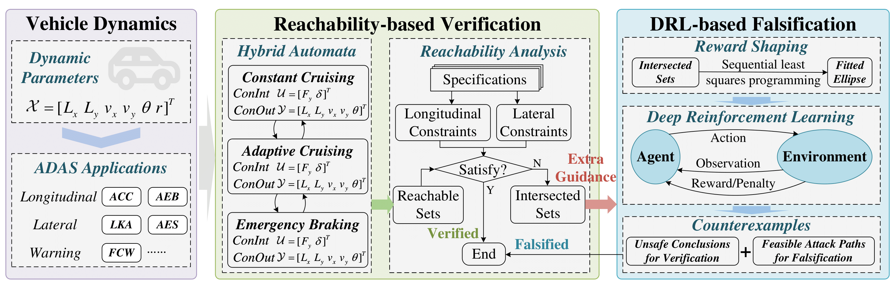

<!-- 1. 引入KaTeX必要的样式和脚本 -->
<link rel="stylesheet" href="https://cdn.jsdelivr.net/npm/katex@0.16.9/dist/katex.min.css">

<!-- 2. 触发公式渲染的脚本 -->

# Enhanced Verification of Safety and Security for Advanced Driver Assistance Systems

 
Code Available: [https://github.com/liuluddex/2D-ADAS-Verification](https://github.com/liuluddex/2D-ADAS-Verification)

### Hybrid Automaton Modeling

#### Vehicle Parameters

In our experiments, vehicle parameters are summarized in Tab. 1. These parameters are corresponding to simulator CarSim, and can be well used in vehicular behavior analysis. They are related to the motion of the vehicle and will be used in the ordinary differential equations (ODEs) that describe the vehicle's motion. For example, when a vehicle is turning, both longitudinal and lateral accelerations are related to the vehicle quality. In addition, the other five parameters are also related to the vehicle's steering movement and vary from vehicle to vehicle.

<table>
    <caption>Tab. 1. Parameters of Vehicles</caption>
    <thead>
        <tr>
            <th></th>
            <th>Quality</th>
            <th>Cornering Stiffness of Front Tires</th>
            <th>Cornering Stiffness of Rear Tires</th>
            <th>Distance between CG and Front Axle</th>
            <th>Distance between CG and Rear Axle</th>
            <th>Inertia of Z-axle</th>
        </tr>
    </thead>
    <tbody>
        <tr>
            <td>Symbol</td>
            <td>m</td>
            <td>$(C_f$)</td>
            <td>$(C_r$)</td>
            <td>$(l_f$)</td>
            <td>$(l_r$)</td>
            <td>$(I_z$)</td>
        </tr>
        <tr>
            <td>Unit</td>
            <td>kg</td>
            <td>N/rad</td>
            <td>N/rad</td>
            <td>m</td>
            <td>m</td>
            <td>-</td>
        </tr>
        <tr>
            <td>Value</td>
            <td>1945</td>
            <td>92064</td>
            <td>92064</td>
            <td>1.265</td>
            <td>1.895</td>
            <td>4095</td>
        </tr>
    </tbody>
</table>

#### Invariance of Discrete Modes

We study the dynamic behaviors between two vehicles and model it using a hybrid automaton. The hybrid automaton contains a total of 4 discrete modes, namely $q_1$ (CC), $q_2$ (ACC), $q_3$ (AEB), and $q_4$ (STOP). Each discrete mode has 6 scenarios $S_1 - S_6$, corresponding to different situations of the two vehicles turning. Tab. 2 illustrates the invariance of the discrete modes in the hybrid automaton. This invariance represents a combination of the mode-specific invariance and the scenario-based invariance. Invariance plays a crucial role in hybrid automata, as it determines whether a discrete mode can be sustained. If the current mode cannot be sustained, the system must transition to another mode based on the defined transition conditions.

<table>
    <caption>Tab. 2. Invariance of Discrete Modes</caption>
    <thead>
        <tr>
            <th>Mode</th>
            <th>Scenario</th>
            <th>Invariance</th>
        </tr>
    </thead>
    <tbody>
        <tr>
            <td rowspan="6">\(q_1\) (CC)</td>
            <td>\(S_1\)</td>
            <td>$(d_r \geq 75 \& L_{y_1} \leq d_1 \& L_{y_2} \leq d_1 \& \theta_1 = 0 \& \theta_2 = 0$)</td>
        </tr>
        <tr>
            <td>\(S_2\)</td>
            <td>\(d_r \geq 75 \& L_{y_1} \leq d_1 \& L_{y_2} \geq d_1 \& \theta_1 = 0 \& \theta_2 \leq \frac{\pi}{2}\)</td>
        </tr>
        <tr>
            <td>\(S_3\)</td>
            <td>\(d_r \geq 75 \& L_{y_1} \leq d_1 \& L_{y_2} \geq d_1 \& \theta_1 = 0 \& \theta_2 \geq \frac{\pi}{2}\)</td>
        </tr>
        <tr>
            <td>\(S_4\)</td>
            <td>\(d_r \geq 75 \& L_{y_1} \geq d_1 \& L_{y_2} \geq d_1 \& \theta_1 \leq \frac{\pi}{2} \& \theta_2 \leq \frac{\pi}{2}\)</td>
        </tr>
        <tr>
            <td>\(S_5\)</td>
            <td>\(d_r \geq 75 \& L_{y_1} \geq d_1 \& L_{y_2} \geq d_1 \& \theta_1 \leq \frac{\pi}{2} \& \theta_2 \geq \frac{\pi}{2}\)</td>
        </tr>
        <tr>
            <td>\(S_6\)</td>
            <td>\(d_r \geq 75 \& L_{y_1} \geq d_1 \& L_{y_2} \geq d_1 \& \theta_1 \geq \frac{\pi}{2} \& \theta_2 \geq \frac{\pi}{2}\)</td>
        </tr>
        <tr>
            <td rowspan="6">\(q_2\) (ACC)</td>
            <td>\(S_1\)</td>
            <td>\(v_{y_2} - v_{y_1} \leq 0 \& -(d_r - 3) - 1.6 * (v_{y_2} - v_{y_1}) \leq 0 \& d_r \geq 3 \& d_r \leq d_0 \& L_{y_1} \leq d_1 \& L_{y_2} \leq d_1 \& \theta_1 = 0 \& \theta_2 = 0\)</td>
        </tr>
        <tr>
            <td>\(S_2\)</td>
            <td>\(v_{y_2} - v_{y_1} \leq 0 \& -(d_r - 3) - 1.6 * (v_{y_2} - v_{y_1}) \leq 0 \& d_r \geq 3 \& d_r \leq d_0 \& L_{y_1} \leq d_1 \& L_{y_2} \geq d_1 \& \theta_1 = 0 \& \theta_2 \leq \frac{\pi}{2}\)</td>
        </tr>
        <tr>
            <td>\(S_3\)</td>
            <td>\(v_{y_2} - v_{y_1} \leq 0 \& -(d_r - 3) - 1.6 * (v_{y_2} - v_{y_1}) \leq 0 \& d_r \geq 3 \& d_r \leq d_0 \& L_{y_1} \leq d_1 \& L_{y_2} \geq d_1 \& \theta_1 = 0 \& \theta_2 \geq \frac{\pi}{2}\)</td>
        </tr>
        <tr>
            <td>\(S_4\)</td>
            <td>\(v_{y_2} - v_{y_1} \leq 0 \& -(d_r - 3) - 1.6 * (v_{y_2} - v_{y_1}) \leq 0 \& d_r \geq 3 \& d_r \leq d_0 \& L_{y_1} \geq d_1 \& L_{y_2} \geq d_1 \& \theta_1 \leq \frac{\pi}{2} \& \theta_2 \leq \frac{\pi}{2}\)</td>
        </tr>
        <tr>
            <td>\(S_5\)</td>
            <td>\(v_{y_2} - v_{y_1} \leq 0 \& -(d_r - 3) - 1.6 * (v_{y_2} - v_{y_1}) \leq 0 \& d_r \geq 3 \& d_r \leq d_0 \& L_{y_1} \geq d_1 \& L_{y_2} \geq d_1 \& \theta_1 \leq \frac{\pi}{2} \& \theta_2 \geq \frac{\pi}{2}\)</td>
        </tr>
        <tr>
            <td>\(S_6\)</td>
            <td>\(v_{y_2} - v_{y_1} \leq 0 \& -(d_r - 3) - 1.6 * (v_{y_2} - v_{y_1}) \leq 0 \& d_r \geq 3 \& d_r \leq d_0 \& L_{y_1} \geq d_1 \& L_{y_2} \geq d_1 \& \theta_1 \geq \frac{\pi}{2} \& \theta_2 \geq \frac{\pi}{2}\)</td>
        </tr>
        <tr>
            <td rowspan="6">\(q_3\) (AEB)</td>
            <td>\(S_1\)</td>
            <td>\(v_{y_2} - v_{y_1} \leq 0 \& -(d_r - 3) - 1.6 * (v_{y_2} - v_{y_1}) \geq 0 \& -(d_r - 3) - 0.6 * (v_{y_2} - v_{y_1}) \leq 0 \& d_r \geq 3 \& d_r \leq d_0 \& L_{y_1} \leq d_1 \& L_{y_2} \leq d_1 \& \theta_1 = 0 \& \theta_2 = 0\)</td>
        </tr>
        <tr>
            <td>\(S_2\)</td>
            <td>\(v_{y_2} - v_{y_1} \leq 0 \& -(d_r - 3) - 1.6 * (v_{y_2} - v_{y_1}) \geq 0 \& -(d_r - 3) - 0.6 * (v_{y_2} - v_{y_1}) \leq 0 \& d_r \geq 3 \& d_r \leq d_0 \& L_{y_1} \leq d_1 \& L_{y_2} \geq d_1 \& \theta_1 = 0 \& \theta_2 \leq \frac{\pi}{2}\)</td>
        </tr>
        <tr>
            <td>\(S_3\)</td>
            <td>\(v_{y_2} - v_{y_1} \leq 0 \& -(d_r - 3) - 1.6 * (v_{y_2} - v_{y_1}) \geq 0 \& -(d_r - 3) - 0.6 * (v_{y_2} - v_{y_1}) \leq 0 \& d_r \geq 3 \& d_r \leq d_0 \& L_{y_1} \leq d_1 \& L_{y_2} \geq d_1 \& \theta_1 = 0 \& \theta_2 \geq \frac{\pi}{2}\)</td>
        </tr>
        <tr>
            <td>\(S_4\)</td>
            <td>\(v_{y_2} - v_{y_1} \leq 0 \& -(d_r - 3) - 1.6 * (v_{y_2} - v_{y_1}) \geq 0 \& -(d_r - 3) - 0.6 * (v_{y_2} - v_{y_1}) \leq 0 \& d_r \geq 3 \& d_r \leq d_0 \& L_{y_1} \geq d_1 \& L_{y_2} \geq d_1 \& \theta_1 \leq \frac{\pi}{2} \& \theta_2 \leq \frac{\pi}{2}\)</td>
        </tr>
        <tr>
            <td>\(S_5\)</td>
            <td>\(v_{y_2} - v_{y_1} \leq 0 \& -(d_r - 3) - 1.6 * (v_{y_2} - v_{y_1}) \geq 0 \& -(d_r - 3) - 0.6 * (v_{y_2} - v_{y_1}) \leq 0 \& d_r \geq 3 \& d_r \leq d_0 \& L_{y_1} \geq d_1 \& L_{y_2} \geq d_1 \& \theta_1 \leq \frac{\pi}{2} \& \theta_2 \geq \frac{\pi}{2}\)</td>
        </tr>
        <tr>
            <td>\(S_6\)</td>
            <td>\(v_{y_2} - v_{y_1} \leq 0 \& -(d_r - 3) - 1.6 * (v_{y_2} - v_{y_1}) \geq 0 \& -(d_r - 3) - 0.6 * (v_{y_2} - v_{y_1}) \leq 0 \& d_r \geq 3 \& d_r \leq d_0 \& L_{y_1} \geq d_1 \& L_{y_2} \geq d_1 \& \theta_1 \geq \frac{\pi}{2} \& \theta_2 \geq \frac{\pi}{2}\)</td>
        </tr>
        <tr>
            <td rowspan="6">\(q_4\) (STOP)</td>
            <td>\(S_1\)</td>
            <td>\(v_{y_1} \geq 1 \& d_r \geq 3 \& L_{y_1} \leq d_1 \& L_{y_2} \leq d_1 \& \theta_1 = 0 \& \theta_2 = 0\)</td>
        </tr>
        <tr>
            <td>\(S_2\)</td>
            <td>\(v_{y_1} \geq 1 \& d_r \geq 3 \& L_{y_1} \leq d_1 \& L_{y_2} \geq d_1 \& \theta_1 = 0 \& \theta_2 \leq \frac{\pi}{2}\)</td>
        </tr>
        <tr>
            <td>\(S_3\)</td>
            <td>\(v_{y_1} \geq 1 \& d_r \geq 3 \& L_{y_1} \leq d_1 \& L_{y_2} \geq d_1 \& \theta_1 = 0 \& \theta_2 \geq \frac{\pi}{2}\)</td>
        </tr>
        <tr>
            <td>\(S_4\)</td>
            <td>\(v_{y_1} \geq 1 \& d_r \geq 3 \& L_{y_1} \geq d_1 \& L_{y_2} \geq d_1 \& \theta_1 \leq \frac{\pi}{2} \& \theta_2 \leq \frac{\pi}{2}\)</td>
        </tr>
        <tr>
            <td>\(S_5\)</td>
            <td>\(v_{y_1} \geq 1 \& d_r \geq 3 \& L_{y_1} \geq d_1 \& L_{y_2} \geq d_1 \& \theta_1 \leq \frac{\pi}{2} \& \theta_2 \geq \frac{\pi}{2}\)</td>
        </tr>
        <tr>
            <td>\(S_6\)</td>
            <td>\(v_{y_1} \geq 1 \& d_r \geq 3 \& L_{y_1} \geq d_1 \& L_{y_2} \geq d_1 \& \theta_1 \geq \frac{\pi}{2} \& \theta_2 \geq \frac{\pi}{2}\)</td>
        </tr>
    </tbody>
</table>

#### Transition Relation

Tab. 3 shows the transition relation between different discrete modes of the hybrid automaton. Some are mode switches, others are scenario switches, and their corresponding conditions and resets are shown. It is necessary to specify both the source mode and scenario and the target mode and scenario. The core of the transition relation lies in condition and reset, one is the condition of transition, and the other is to reset certain state quantities during the transfer. Here, we study the dynamic behaviors of two vehicles on a single lane in a 90-degree turn scenario. Both vehicles have three different steering scenarios, which together give a total of six different scenarios. The switching of scenarios is related to the reset of $\delta$, which is crucial for steering. During state transitions, we reset $\delta$ and $r$. Similarly, during mode transitions, we reset $q$.

<table>
    <caption>Tab. 3. Transition Relation</caption>
    <thead>
        <tr>
            <th>Source Mode</th>
            <th>Source Scenario</th>
            <th>Target Mode</th>
            <th>Target Scenario</th>
            <th>Condition</th>
            <th>Reset</th>
        </tr>
    </thead>
    <tbody>
        <tr>
            <td>\(q_1\) (CC)</td>
            <td>\(S_1\)</td>
            <td>\(q_1\) (CC)</td>
            <td>\(S_2\)</td>
            <td>\(L_{y_1} \leq d_1 \& L_{y_2} \geq d_1\)</td>
            <td>\(\delta_2' := 0.07, r_2' := 0\)</td>
        </tr>
        <tr>
            <td>\(q_2\) (ACC)</td>
            <td>\(S_1\)</td>
            <td>\(q_2\) (ACC)</td>
            <td>\(S_2\)</td>
            <td>\(L_{y_1} \leq d_1 \& L_{y_2} \geq d_1\)</td>
            <td>\(\delta_2' := 0.07, r_2' := 0\)</td>
        </tr>
        <tr>
            <td>\(q_3\) (AEB)</td>
            <td>\(S_1\)</td>
            <td>\(q_3\) (AEB)</td>
            <td>\(S_2\)</td>
            <td>\(L_{y_1} \leq d_1 \& L_{y_2} \geq d_1\)</td>
            <td>\(\delta_2' := 0.07, r_2' := 0\)</td>
        </tr>
        <tr>
            <td>\(q_4\) (STOP)</td>
            <td>\(S_1\)</td>
            <td>\(q_4\) (STOP)</td>
            <td>\(S_2\)</td>
            <td>\(L_{y_1} \leq d_1 \& L_{y_2} \geq d_1\)</td>
            <td>\(\delta_2' := 0.07, r_2' := 0\)</td>
        </tr>
        <tr>
            <td>\(q_1\) (CC)</td>
            <td>\(S_2\)</td>
            <td>\(q_1\) (CC)</td>
            <td>\(S_3\)</td>
            <td>\(L_{y_1} \leq d_1 \& L_{y_2} \geq d_1 \& \theta_2 \geq \frac{\pi}{2}\)</td>
            <td>\(\delta_2' := 0, r_2' := 0\)</td>
        </tr>
        <tr>
            <td>\(q_2\) (ACC)</td>
            <td>\(S_2\)</td>
            <td>\(q_2\) (ACC)</td>
            <td>\(S_3\)</td>
            <td>\(L_{y_1} \leq d_1 \& L_{y_2} \geq d_1 \& \theta_2 \geq \frac{\pi}{2}\)</td>
            <td>\(\delta_2' := 0, r_2' := 0\)</td>
        </tr>
        <tr>
            <td>\(q_3\) (AEB)</td>
            <td>\(S_2\)</td>
            <td>\(q_3\) (AEB)</td>
            <td>\(S_3\)</td>
            <td>\(L_{y_1} \leq d_1 \& L_{y_2} \geq d_1 \& \theta_2 \geq \frac{\pi}{2}\)</td>
            <td>\(\delta_2' := 0, r_2' := 0\)</td>
        </tr>
        <tr>
            <td>\(q_4\) (STOP)</td>
            <td>\(S_2\)</td>
            <td>\(q_4\) (STOP)</td>
            <td>\(S_3\)</td>
            <td>\(L_{y_1} \leq d_1 \& L_{y_2} \geq d_1 \& \theta_2 \geq \frac{\pi}{2}\)</td>
            <td>\(\delta_2' := 0, r_2' := 0\)</td>
        </tr>
        <tr>
            <td>\(q_1\) (CC)</td>
            <td>\(S_2\)</td>
            <td>\(q_1\) (CC)</td>
            <td>\(S_4\)</td>
            <td>\(L_{y_1} \geq d_1 \& L_{y_2} \geq d_1 \& \theta_1 \leq \frac{\pi}{2} \& \theta_2 \leq \frac{\pi}{2}\)</td>
            <td>\(\delta_1' := 0.07, r_1' := 0\)</td>
        </tr>
        <tr>
            <td>\(q_2\) (ACC)</td>
            <td>\(S_2\)</td>
            <td>\(q_2\) (ACC)</td>
            <td>\(S_4\)</td>
            <td>\(L_{y_1} \geq d_1 \& L_{y_2} \geq d_1 \& \theta_1 \leq \frac{\pi}{2} \& \theta_2 \leq \frac{\pi}{2}\)</td>
            <td>\(\delta_1' := 0.07, r_1' := 0\)</td>
        </tr>
        <tr>
            <td>\(q_3\) (AEB)</td>
            <td>\(S_2\)</td>
            <td>\(q_3\) (AEB)</td>
            <td>\(S_4\)</td>
            <td>\(L_{y_1} \geq d_1 \& L_{y_2} \geq d_1 \& \theta_1 \leq \frac{\pi}{2} \& \theta_2 \leq \frac{\pi}{2}\)</td>
            <td>\(\delta_1' := 0.07, r_1' := 0\)</td>
        </tr>
        <tr>
            <td>\(q_4\) (STOP)</td>
            <td>\(S_2\)</td>
            <td>\(q_4\) (STOP)</td>
            <td>\(S_4\)</td>
            <td>\(L_{y_1} \geq d_1 \& L_{y_2} \geq d_1 \& \theta_1 \leq \frac{\pi}{2} \& \theta_2 \leq \frac{\pi}{2}\)</td>
            <td>\(\delta_1' := 0.07, r_1' := 0\)</td>
        </tr>
        <tr>
            <td>\(q_1\) (CC)</td>
            <td>\(S_3\)</td>
            <td>\(q_1\) (CC)</td>
            <td>\(S_5\)</td>
            <td>\(L_{y_1} \geq d_1 \& L_{y_2} \geq d_1 \& \theta_1 \leq \frac{\pi}{2} \& \theta_2 \geq \frac{\pi}{2}\)</td>
            <td>\(\delta_1' := 0.07, r_1' := 0\)</td>
        </tr>
        <tr>
            <td>\(q_2\) (ACC)</td>
            <td>\(S_3\)</td>
            <td>\(q_2\) (ACC)</td>
            <td>\(S_5\)</td>
            <td>\(L_{y_1} \geq d_1 \& L_{y_2} \geq d_1 \& \theta_1 \leq \frac{\pi}{2} \& \theta_2 \geq \frac{\pi}{2}\)</td>
            <td>\(\delta_1' := 0.07, r_1' := 0\)</td>
        </tr>
        <tr>
            <td>\(q_3\) (AEB)</td>
            <td>\(S_3\)</td>
            <td>\(q_3\) (AEB)</td>
            <td>\(S_5\)</td>
            <td>\(L_{y_1} \geq d_1 \& L_{y_2} \geq d_1 \& \theta_1 \leq \frac{\pi}{2} \& \theta_2 \geq \frac{\pi}{2}\)</td>
            <td>\(\delta_1' := 0.07, r_1' := 0\)</td>
        </tr>
        <tr>
            <td>\(q_4\) (STOP)</td>
            <td>\(S_3\)</td>
            <td>\(q_4\) (STOP)</td>
            <td>\(S_5\)</td>
            <td>\(L_{y_1} \geq d_1 \& L_{y_2} \geq d_1 \& \theta_1 \leq \frac{\pi}{2} \& \theta_2 \geq \frac{\pi}{2}\)</td>
            <td>\(\delta_1' := 0.07, r_1' := 0\)</td>
        </tr>
        <tr>
            <td>\(q_1\) (CC)</td>
            <td>\(S_4\)</td>
            <td>\(q_1\) (CC)</td>
            <td>\(S_5\)</td>
            <td>\(L_{y_1} \geq d_1 \& L_{y_2} \geq d_1 \& \theta_1 \leq \frac{\pi}{2} \& \theta_2 \geq \frac{\pi}{2}\)</td>
            <td>\(\delta_2' := 0, r_2' := 0\)</td>
        </tr>
        <tr>
            <td>\(q_2\) (ACC)</td>
            <td>\(S_4\)</td>
            <td>\(q_2\) (ACC)</td>
            <td>\(S_5\)</td>
            <td>\(L_{y_1} \geq d_1 \& L_{y_2} \geq d_1 \& \theta_1 \leq \frac{\pi}{2} \& \theta_2 \geq \frac{\pi}{2}\)</td>
            <td>\(\delta_2' := 0, r_2' := 0\)</td>
        </tr>
        <tr>
            <td>\(q_3\) (AEB)</td>
            <td>\(S_4\)</td>
            <td>\(q_3\) (AEB)</td>
            <td>\(S_5\)</td>
            <td>\(L_{y_1} \geq d_1 \& L_{y_2} \geq d_1 \& \theta_1 \leq \frac{\pi}{2} \& \theta_2 \geq \frac{\pi}{2}\)</td>
            <td>\(\delta_2' := 0, r_2' := 0\)</td>
        </tr>
        <tr>
            <td>\(q_4\) (STOP)</td>
            <td>\(S_4\)</td>
            <td>\(q_4\) (STOP)</td>
            <td>\(S_5\)</td>
            <td>\(L_{y_1} \geq d_1 \& L_{y_2} \geq d_1 \& \theta_1 \leq \frac{\pi}{2} \& \theta_2 \geq \frac{\pi}{2}\)</td>
            <td>\(\delta_2' := 0, r_2' := 0\)</td>
        </tr>
        <tr>
            <td>\(q_1\) (CC)</td>
            <td>\(S_5\)</td>
            <td>\(q_1\) (CC)</td>
            <td>\(S_6\)</td>
            <td>\(L_{y_1} \geq d_1 \& L_{y_2} \geq d_1 \& \theta_1 \geq \frac{\pi}{2} \& \theta_2 \geq \frac{\pi}{2}\)</td>
            <td>\(\delta_1' := 0, r_1' := 0\)</td>
        </tr>
        <tr>
            <td>\(q_2\) (ACC)</td>
            <td>\(S_5\)</td>
            <td>\(q_2\) (ACC)</td>
            <td>\(S_6\)</td>
            <td>\(L_{y_1} \geq d_1 \& L_{y_2} \geq d_1 \& \theta_1 \geq \frac{\pi}{2} \& \theta_2 \geq \frac{\pi}{2}\)</td>
            <td>\(\delta_1' := 0, r_1' := 0\)</td>
        </tr>
        <tr>
            <td>\(q_3\) (AEB)</td>
            <td>\(S_5\)</td>
            <td>\(q_3\) (AEB)</td>
            <td>\(S_6\)</td>
            <td>\(L_{y_1} \geq d_1 \& L_{y_2} \geq d_1 \& \theta_1 \geq \frac{\pi}{2} \& \theta_2 \geq \frac{\pi}{2}\)</td>
            <td>\(\delta_1' := 0, r_1' := 0\)</td>
        </tr>
        <tr>
            <td>\(q_4\) (STOP)</td>
            <td>\(S_5\)</td>
            <td>\(q_4\) (STOP)</td>
            <td>\(S_6\)</td>
            <td>\(L_{y_1} \geq d_1 \& L_{y_2} \geq d_1 \& \theta_1 \geq \frac{\pi}{2} \& \theta_2 \geq \frac{\pi}{2}\)</td>
            <td>\(\delta_1' := 0, r_1' := 0\)</td>
        </tr>
        <tr>
            <td>\(q_1\) (CC)</td>
            <td>\(S_1\)</td>
            <td>\(q_3\) (AEB)</td>
            <td>\(S_1\)</td>
            <td>\(v_{y_2} - v_{y_1} \leq 0 \& -d_r - 1.6 \cdot (v_{y_2} - v_{y_1}) \geq 0 \& d_r \geq 3 \& d_r \leq d_0\)</td>
            <td>\(q' := 3\)</td>
        </tr>
        <tr>
            <td>\(q_1\) (CC)</td>
            <td>\(S_2\)</td>
            <td>\(q_3\) (AEB)</td>
            <td>\(S_2\)</td>
            <td>\(v_{y_2} - v_{y_1} \leq 0 \& -d_r - 1.6 \cdot (v_{y_2} - v_{y_1}) \geq 0 \& d_r \geq 3 \& d_r \leq d_0\)</td>
            <td>\(q' := 3\)</td>
        </tr>
        <tr>
            <td>\(q_1\) (CC)</td>
            <td>\(S_3\)</td>
            <td>\(q_3\) (AEB)</td>
            <td>\(S_3\)</td>
            <td>\(v_{y_2} - v_{y_1} \leq 0 \& -d_r - 1.6 \cdot (v_{y_2} - v_{y_1}) \geq 0 \& d_r \geq 3 \& d_r \leq d_0\)</td>
            <td>\(q' := 3\)</td>
        </tr>
        <tr>
            <td>\(q_1\) (CC)</td>
            <td>\(S_4\)</td>
            <td>\(q_3\) (AEB)</td>
            <td>\(S_4\)</td>
            <td>\(v_{y_2} - v_{y_1} \leq 0 \& -d_r - 1.6 \cdot (v_{y_2} - v_{y_1}) \geq 0 \& d_r \geq 3 \& d_r \leq d_0\)</td>
            <td>\(q' := 3\)</td>
        </tr>
        <tr>
            <td>\(q_1\) (CC)</td>
            <td>\(S_5\)</td>
            <td>\(q_3\) (AEB)</td>
            <td>\(S_5\)</td>
            <td>\(v_{y_2} - v_{y_1} \leq 0 \& -d_r - 1.6 \cdot (v_{y_2} - v_{y_1}) \geq 0 \& d_r \geq 3 \& d_r \leq d_0\)</td>
            <td>\(q' := 3\)</td>
        </tr>
        <tr>
            <td>\(q_1\) (CC)</td>
            <td>\(S_6\)</td>
            <td>\(q_3\) (AEB)</td>
            <td>\(S_6\)</td>
            <td>\(v_{y_2} - v_{y_1} \leq 0 \& -d_r - 1.6 \cdot (v_{y_2} - v_{y_1}) \geq 0 \& d_r \geq 3 \& d_r \leq d_0\)</td>
            <td>\(q' := 3\)</td>
        </tr>
        <tr>
            <td>\(q_1\) (CC)</td>
            <td>\(S_1\)</td>
            <td>\(q_2\) (ACC)</td>
            <td>\(S_1\)</td>
            <td>\(v_{y_2} - v_{y_1} \leq 0 \& -d_r - 1.6 \cdot (v_{y_2} - v_{y_1}) \leq 0 \& d_r \geq 3 \& d_r \leq d_0\)</td>
            <td>\(q' := 2\)</td>
        </tr>
        <tr>
            <td>\(q_1\) (CC)</td>
            <td>\(S_2\)</td>
            <td>\(q_2\) (ACC)</td>
            <td>\(S_2\)</td>
            <td>\(v_{y_2} - v_{y_1} \leq 0 \& -d_r - 1.6 \cdot (v_{y_2} - v_{y_1}) \leq 0 \& d_r \geq 3 \& d_r \leq d_0\)</td>
            <td>\(q' := 2\)</td>
        </tr>
        <tr>
            <td>\(q_1\) (CC)</td>
            <td>\(S_3\)</td>
            <td>\(q_2\) (ACC)</td>
            <td>\(S_3\)</td>
            <td>\(v_{y_2} - v_{y_1} \leq 0 \& -d_r - 1.6 \cdot (v_{y_2} - v_{y_1}) \leq 0 \& d_r \geq 3 \& d_r \leq d_0\)</td>
            <td>\(q' := 2\)</td>
        </tr>
        <tr>
            <td>\(q_1\) (CC)</td>
            <td>\(S_4\)</td>
            <td>\(q_2\) (ACC)</td>
            <td>\(S_4\)</td>
            <td>\(v_{y_2} - v_{y_1} \leq 0 \& -d_r - 1.6 \cdot (v_{y_2} - v_{y_1}) \leq 0 \& d_r \geq 3 \& d_r \leq d_0\)</td>
            <td>\(q' := 2\)</td>
        </tr>
        <tr>
            <td>\(q_1\) (CC)</td>
            <td>\(S_5\)</td>
            <td>\(q_2\) (ACC)</td>
            <td>\(S_5\)</td>
            <td>\(v_{y_2} - v_{y_1} \leq 0 \& -d_r - 1.6 \cdot (v_{y_2} - v_{y_1}) \leq 0 \& d_r \geq 3 \& d_r \leq d_0\)</td>
            <td>\(q' := 2\)</td>
        </tr>
        <tr>
            <td>\(q_1\) (CC)</td>
            <td>\(S_6\)</td>
            <td>\(q_2\) (ACC)</td>
            <td>\(S_6\)</td>
            <td>\(v_{y_2} - v_{y_1} \leq 0 \& -d_r - 1.6 \cdot (v_{y_2} - v_{y_1}) \leq 0 \& d_r \geq 3 \& d_r \leq d_0\)</td>
            <td>\(q' := 2\)</td>
        </tr>
        <tr>
            <td>\(q_2\) (ACC)</td>
            <td>\(S_1\)</td>
            <td>\(q_3\) (AEB)</td>
            <td>\(S_1\)</td>
            <td>\(v_{y_2} - v_{y_1} \leq 0 \& -d_r - 1.6 * (v_{y_2} - v_{y_1}) \geq 0 \& d_r \geq 3\)</td>
            <td>\(q' := 3\)</td>
        </tr>
        <tr>
            <td>\(q_2\) (ACC)</td>
            <td>\(S_2\)</td>
            <td>\(q_3\) (AEB)</td>
            <td>\(S_2\)</td>
            <td>\(v_{y_2} - v_{y_1} \leq 0 \& -d_r - 1.6 * (v_{y_2} - v_{y_1}) \geq 0 \& d_r \geq 3\)</td>
            <td>\(q' := 3\)</td>
        </tr>
        <tr>
            <td>\(q_2\) (ACC)</td>
            <td>\(S_3\)</td>
            <td>\(q_3\) (AEB)</td>
            <td>\(S_3\)</td>
            <td>\(v_{y_2} - v_{y_1} \leq 0 \& -d_r - 1.6 * (v_{y_2} - v_{y_1}) \geq 0 \& d_r \geq 3\)</td>
            <td>\(q' := 3\)</td>
        </tr>
        <tr>
            <td>\(q_2\) (ACC)</td>
            <td>\(S_4\)</td>
            <td>\(q_3\) (AEB)</td>
            <td>\(S_4\)</td>
            <td>\(v_{y_2} - v_{y_1} \leq 0 \& -d_r - 1.6 * (v_{y_2} - v_{y_1}) \geq 0 \& d_r \geq 3\)</td>
            <td>\(q' := 3\)</td>
        </tr>
        <tr>
            <td>\(q_2\) (ACC)</td>
            <td>\(S_5\)</td>
            <td>\(q_3\) (AEB)</td>
            <td>\(S_5\)</td>
            <td>\(v_{y_2} - v_{y_1} \leq 0 \& -d_r - 1.6 * (v_{y_2} - v_{y_1}) \geq 0 \& d_r \geq 3\)</td>
            <td>\(q' := 3\)</td>
        </tr>
        <tr>
            <td>\(q_2\) (ACC)</td>
            <td>\(S_6\)</td>
            <td>\(q_3\) (AEB)</td>
            <td>\(S_6\)</td>
            <td>\(v_{y_2} - v_{y_1} \leq 0 \& -d_r - 1.6 * (v_{y_2} - v_{y_1}) \geq 0 \& d_r \geq 3\)</td>
            <td>\(q' := 3\)</td>
        </tr>
        <tr>
            <td>\(q_3\) (AEB)</td>
            <td>\(S_1\)</td>
            <td>\(q_2\) (ACC)</td>
            <td>\(S_1\)</td>
            <td>\(v_{y_2} - v_{y_1} \leq 0 \& -d_r - 1.6 * (v_{y_2} - v_{y_1}) \leq 0 \& d_r \geq 3\)</td>
            <td>\(q' := 2\)</td>
        </tr>
        <tr>
            <td>\(q_3\) (AEB)</td>
            <td>\(S_2\)</td>
            <td>\(q_2\) (ACC)</td>
            <td>\(S_2\)</td>
            <td>\(v_{y_2} - v_{y_1} \leq 0 \& -d_r - 1.6 * (v_{y_2} - v_{y_1}) \leq 0 \& d_r \geq 3\)</td>
            <td>\(q' := 2\)</td>
        </tr>
        <tr>
            <td>\(q_3\) (AEB)</td>
            <td>\(S_3\)</td>
            <td>\(q_2\) (ACC)</td>
            <td>\(S_3\)</td>
            <td>\(v_{y_2} - v_{y_1} \leq 0 \& -d_r - 1.6 * (v_{y_2} - v_{y_1}) \leq 0 \& d_r \geq 3\)</td>
            <td>\(q' := 2\)</td>
        </tr>
        <tr>
            <td>\(q_3\) (AEB)</td>
            <td>\(S_4\)</td>
            <td>\(q_2\) (ACC)</td>
            <td>\(S_4\)</td>
            <td>\(v_{y_2} - v_{y_1} \leq 0 \& -d_r - 1.6 * (v_{y_2} - v_{y_1}) \leq 0 \& d_r \geq 3\)</td>
            <td>\(q' := 2\)</td>
        </tr>
        <tr>
            <td>\(q_3\) (AEB)</td>
            <td>\(S_5\)</td>
            <td>\(q_2\) (ACC)</td>
            <td>\(S_5\)</td>
            <td>\(v_{y_2} - v_{y_1} \leq 0 \& -d_r - 1.6 * (v_{y_2} - v_{y_1}) \leq 0 \& d_r \geq 3\)</td>
            <td>\(q' := 2\)</td>
        </tr>
        <tr>
            <td>\(q_3\) (AEB)</td>
            <td>\(S_6\)</td>
            <td>\(q_2\) (ACC)</td>
            <td>\(S_6\)</td>
            <td>\(v_{y_2} - v_{y_1} \leq 0 \& -d_r - 1.6 * (v_{y_2} - v_{y_1}) \leq 0 \& d_r \geq 3\)</td>
            <td>\(q' := 2\)</td>
        </tr>
        <tr>
            <td>\(q_3\) (AEB)</td>
            <td>\(S_1\)</td>
            <td>\(q_4\) (STOP)</td>
            <td>\(S_1\)</td>
            <td>\(v_{y_1} \geq 0 \& -d_r - 0.6 * (v_{y_2} - v_{y_1}) \geq 0 \& d_r \geq 3\)</td>
            <td>\(q' := 4\)</td>
        </tr>
        <tr>
            <td>\(q_3\) (AEB)</td>
            <td>\(S_2\)</td>
            <td>\(q_4\) (STOP)</td>
            <td>\(S_2\)</td>
            <td>\(v_{y_1} \geq 0 \& -d_r - 0.6 * (v_{y_2} - v_{y_1}) \geq 0 \& d_r \geq 3\)</td>
            <td>\(q' := 4\)</td>
        </tr>
        <tr>
            <td>\(q_3\) (AEB)</td>
            <td>\(S_3\)</td>
            <td>\(q_4\) (STOP)</td>
            <td>\(S_3\)</td>
            <td>\(v_{y_1} \geq 0 \& -d_r - 0.6 * (v_{y_2} - v_{y_1}) \geq 0 \& d_r \geq 3\)</td>
            <td>\(q' := 4\)</td>
        </tr>
        <tr>
            <td>\(q_3\) (AEB)</td>
            <td>\(S_4\)</td>
            <td>\(q_4\) (STOP)</td>
            <td>\(S_4\)</td>
            <td>\(v_{y_1} \geq 0 \& -d_r - 0.6 * (v_{y_2} - v_{y_1}) \geq 0 \& d_r \geq 3\)</td>
            <td>\(q' := 4\)</td>
        </tr>
        <tr>
            <td>\(q_3\) (AEB)</td>
            <td>\(S_5\)</td>
            <td>\(q_4\) (STOP)</td>
            <td>\(S_5\)</td>
            <td>\(v_{y_1} \geq 0 \& -d_r - 0.6 * (v_{y_2} - v_{y_1}) \geq 0 \& d_r \geq 3\)</td>
            <td>\(q' := 4\)</td>
        </tr>
        <tr>
            <td>\(q_3\) (AEB)</td>
            <td>\(S_6\)</td>
            <td>\(q_4\) (STOP)</td>
            <td>\(S_6\)</td>
            <td>\(v_{y_1} \geq 0 \& -d_r - 0.6 * (v_{y_2} - v_{y_1}) \geq 0 \& d_r \geq 3\)</td>
            <td>\(q' := 4\)</td>
        </tr>
    </tbody>
</table>

So far, we have introduced and listed the core of hybrid automata in detail. Parameter values, invariance, and transition relations are crucial to hybrid automata. With these, we can build a hybrid automaton and conduct subsequent experimental analysis. The Flow* model under normal conditions is shown in [normal.model](https://liuluddex.github.io/uploads/2D-ADAS-Verification/normal.model). With Flow*, we can compute the reachable sets under a specified initial state set.

#### Normal Behavior Analysis

Tab. 4 shows the six initial state sets used for normal behavior analysis. These six initial state sets contain six different state transition routes. By setting the initial value of the state quantity, we can put the system in different modes at the beginning and control its mode transfer path to study whether the vehicle will collide in different scenarios. 

<table>
    <caption>Tab. 4. Initial State Sets of Normal Behavior Analysis</caption>
    <thead>
        <tr>
            <th>Set</th>
            <th>Route</th>
            <th>Bound</th>
            <th>\(v_{x_1}\)</th>
            <th>\(v_{y_1}\)</th>
            <th>\(L_{x_1}\)</th>
            <th>\(L_{y_1}\)</th>
            <th>\(\theta_1\)</th>
            <th>\(r_1\)</th>
            <th>\(\delta_1\)</th>
            <th>\(v_{x_2}\)</th>
            <th>\(v_{y_2}\)</th>
            <th>\(L_{x_2}\)</th>
            <th>\(L_{y_2}\)</th>
            <th>\(\theta_2\)</th>
            <th>\(r_2\)</th>
            <th>\(\delta_2\)</th>
            <th>\(t\)</th>
            <th>\(d_r\)</th>
            <th>\(q\)</th>
        </tr>
    </thead>
    <tbody>
        <tr>
            <td rowspan="2">\(In_1\)</td>
            <td rowspan="2">\(q_1\)</td>            
            <td>min</td>
            <td>0.00</td>
            <td>17.00</td>
            <td>0.00</td>
            <td>0.00</td>
            <td>0.00</td>
            <td>0.00</td>
            <td>-1e-9</td>
            <td>0.00</td>
            <td>10.00</td>
            <td>0.00</td>
            <td>98.00</td>
            <td>0.00</td>
            <td>0.00</td>
            <td>-1e-9</td>
            <td>0.00</td>
            <td>98.00</td>
            <td>1</td>
        </tr>
        <tr>
            <td>max</td>
            <td>0.00</td>
            <td>17.01</td>
            <td>0.00</td>
            <td>0.00</td>
            <td>0.00</td>
            <td>0.00</td>
            <td>1e-9</td>
            <td>0.00</td>
            <td>10.00</td>
            <td>0.00</td>
            <td>98.00</td>
            <td>0.00</td>
            <td>0.00</td>
            <td>1e-9</td>
            <td>0.00</td>
            <td>98.00</td>
            <td>1</td>
        </tr>
        <tr>
            <td rowspan="2">\(In_2\)</td>
            <td rowspan="2">\(q_2\)</td>            
            <td>min</td>
            <td>0.00</td>
            <td>17.00</td>
            <td>0.00</td>
            <td>48.00</td>
            <td>0.00</td>
            <td>0.00</td>
            <td>-1e-9</td>
            <td>0.00</td>
            <td>10.00</td>
            <td>0.00</td>
            <td>98.00</td>
            <td>0.00</td>
            <td>0.00</td>
            <td>-1e-9</td>
            <td>0.00</td>
            <td>50.00</td>
            <td>1</td>
        </tr>
        <tr>
            <td>max</td>
            <td>0.00</td>
            <td>17.01</td>
            <td>0.00</td>
            <td>48.00</td>
            <td>0.00</td>
            <td>0.00</td>
            <td>1e-9</td>
            <td>0.00</td>
            <td>10.00</td>
            <td>0.00</td>
            <td>98.00</td>
            <td>0.00</td>
            <td>0.00</td>
            <td>1e-9</td>
            <td>0.00</td>
            <td>50.00</td>
            <td>1</td>
        </tr>
        <tr>
            <td rowspan="2">\(In_3\)</td>
            <td rowspan="2">\(q_1\) -> \(q_2\)</td>            
            <td>min</td>
            <td>0.00</td>
            <td>17.00</td>
            <td>0.00</td>
            <td>18.00</td>
            <td>0.00</td>
            <td>0.00</td>
            <td>-1e-9</td>
            <td>0.00</td>
            <td>10.00</td>
            <td>0.00</td>
            <td>98.00</td>
            <td>0.00</td>
            <td>0.00</td>
            <td>-1e-9</td>
            <td>0.00</td>
            <td>80.00</td>
            <td>1</td>
        </tr>
        <tr>
            <td>max</td>
            <td>0.00</td>
            <td>17.01</td>
            <td>0.00</td>
            <td>18.00</td>
            <td>0.00</td>
            <td>0.00</td>
            <td>1e-9</td>
            <td>0.00</td>
            <td>10.00</td>
            <td>0.00</td>
            <td>98.00</td>
            <td>0.00</td>
            <td>0.00</td>
            <td>1e-9</td>
            <td>0.00</td>
            <td>80.00</td>
            <td>1</td>
        </tr>
        <tr>
            <td rowspan="2">\(In_4\)</td>
            <td rowspan="2">\(q_3\) -> \(q_4\)</td>            
            <td>min</td>
            <td>0.00</td>
            <td>19.99</td>
            <td>0.00</td>
            <td>84.10</td>
            <td>0.00</td>
            <td>0.00</td>
            <td>-1e-9</td>
            <td>0.00</td>
            <td>7.00</td>
            <td>0.00</td>
            <td>98.00</td>
            <td>0.00</td>
            <td>0.00</td>
            <td>-1e-9</td>
            <td>0.00</td>
            <td>13.90</td>
            <td>1</td>
        </tr>
        <tr>
            <td>max</td>
            <td>0.00</td>
            <td>20.00</td>
            <td>0.00</td>
            <td>84.10</td>
            <td>0.00</td>
            <td>0.00</td>
            <td>1e-9</td>
            <td>0.00</td>
            <td>7.00</td>
            <td>0.00</td>
            <td>98.00</td>
            <td>0.00</td>
            <td>0.00</td>
            <td>1e-9</td>
            <td>0.00</td>
            <td>13.90</td>
            <td>1</td>
        </tr>
        <tr>
            <td rowspan="2">\(In_5\)</td>
            <td rowspan="2">\(q_3\) -> \(q_2\)</td>            
            <td>min</td>
            <td>0.00</td>
            <td>15.09</td>
            <td>0.00</td>
            <td>84.10</td>
            <td>0.00</td>
            <td>0.00</td>
            <td>-1e-9</td>
            <td>0.00</td>
            <td>7.00</td>
            <td>0.00</td>
            <td>98.00</td>
            <td>0.00</td>
            <td>0.00</td>
            <td>-1e-9</td>
            <td>0.00</td>
            <td>13.90</td>
            <td>1</td>
        </tr>
        <tr>
            <td>max</td>
            <td>0.00</td>
            <td>15.10</td>
            <td>0.00</td>
            <td>84.10</td>
            <td>0.00</td>
            <td>0.00</td>
            <td>1e-9</td>
            <td>0.00</td>
            <td>7.00</td>
            <td>0.00</td>
            <td>98.00</td>
            <td>0.00</td>
            <td>0.00</td>
            <td>1e-9</td>
            <td>0.00</td>
            <td>13.90</td>
            <td>1</td>
        </tr>
        <tr>
            <td rowspan="2">\(In_6\)</td>
            <td>\(q_3\) -> \(q_2\) -> \(q_3\)</td>            
            <td>min</td>
            <td>0.00</td>
            <td>17.00</td>
            <td>0.00</td>
            <td>87.00</td>
            <td>0.00</td>
            <td>0.00</td>
            <td>-1e-9</td>
            <td>0.00</td>
            <td>12.00</td>
            <td>0.00</td>
            <td>98.00</td>
            <td>0.00</td>
            <td>0.00</td>
            <td>-1e-9</td>
            <td>0.00</td>
            <td>11.00</td>
            <td>1</td>
        </tr>
        <tr>
            <td>\(q_3\) -> \(q_2\)</td>
            <td>max</td>
            <td>0.00</td>
            <td>17.01</td>
            <td>0.00</td>
            <td>87.00</td>
            <td>0.00</td>
            <td>0.00</td>
            <td>1e-9</td>
            <td>0.00</td>
            <td>12.00</td>
            <td>0.00</td>
            <td>98.00</td>
            <td>0.00</td>
            <td>0.00</td>
            <td>1e-9</td>
            <td>0.00</td>
            <td>11.00</td>
            <td>1</td>
        </tr>
    </tbody>  
</table>

#### Reachable Sets with Attacks

In order to further study the impact of attacks under this high-risk situation, we selected two different scenarios of $In_4$. To create this scenario, the initial TTC needs to be less than 1.6 and close to 0.6. Tab. 5 shows two different scenario settings and the range of attack intensity per unit time under the two attack strategies.

<table>
    <caption>Tab. 5. Initial State Sets of Reachable Sets</caption>
    <thead>
        <tr>
            <th>Scenario</th>
            <th>Transition</th>
            <th>Bound</th>
            <th>\(v_{x_1}\)</th>
            <th>\(v_{y_1}\)</th>
            <th>\(L_{x_1}\)</th>
            <th>\(L_{y_1}\)</th>
            <th>\(\theta_1\)</th>
            <th>\(r_1\)</th>
            <th>\(\delta_1\)</th>
            <th>\(v_{x_2}\)</th>
            <th>\(v_{y_2}\)</th>
            <th>\(L_{x_2}\)</th>
            <th>\(L_{y_2}\)</th>
            <th>\(\theta_2\)</th>
            <th>\(r_2\)</th>
            <th>\(\delta_2\)</th>
            <th>\(d_r\)</th>
            <th>\(\omega_{d_r}\)</th>
            <th>\(\omega_{v_{y_1}}\)</th>
        </tr>
    </thead>
    <tbody>
        <tr>
            <td rowspan="2">\(A_1\)</td>
            <td rowspan="2">\(q_3\) -> \(q_4\)</td>            
            <td>min</td>
            <td>0.00</td>
            <td>19.50</td>
            <td>0.00</td>
            <td>84.10</td>
            <td>0.00</td>
            <td>0.00</td>
            <td>-1e-9</td>
            <td>0.00</td>
            <td>7.00</td>
            <td>0.00</td>
            <td>98.00</td>
            <td>0.00</td>
            <td>0.00</td>
            <td>-1e-9</td>
            <td>13.90</td>
            <td>0.00</td>
            <td>-2.40</td>
        </tr>
        <tr>
            <td>max</td>
            <td>0.00</td>
            <td>20.00</td>
            <td>0.00</td>
            <td>84.10</td>
            <td>0.00</td>
            <td>0.00</td>
            <td>1e-9</td>
            <td>0.00</td>
            <td>7.00</td>
            <td>0.00</td>
            <td>98.00</td>
            <td>0.00</td>
            <td>0.00</td>
            <td>1e-9</td>
            <td>13.90</td>
            <td>1.80</td>
            <td>0.00</td>
        </tr>
        <tr>
            <td rowspan="2">\(A_2\)</td>
            <td rowspan="2">\(q_3\) -> \(q_4\)</td>            
            <td>min</td>
            <td>-0.01</td>
            <td>17.50</td>
            <td>0.00</td>
            <td>85.10</td>
            <td>0.00</td>
            <td>0.00</td>
            <td>-1e-9</td>
            <td>0.00</td>
            <td>5.00</td>
            <td>0.00</td>
            <td>99.00</td>
            <td>0.00</td>
            <td>0.00</td>
            <td>-1e-9</td>
            <td>13.90</td>
            <td>0.00</td>
            <td>-2.40</td>
        </tr>
        <tr>
            <td>max</td>
            <td>0.01</td>
            <td>18.00</td>
            <td>0.00</td>
            <td>85.10</td>
            <td>0.00</td>
            <td>0.00</td>
            <td>1e-9</td>
            <td>0.00</td>
            <td>5.00</td>
            <td>0.00</td>
            <td>99.00</td>
            <td>0.00</td>
            <td>0.00</td>
            <td>1e-9</td>
            <td>13.90</td>
            <td>1.80</td>
            <td>0.00</td>
        </tr>
    </tbody>
</table>

#### Tool Error Comparisons

Due to the falsification part, we use Python to implement a method based on deep reinforcement learning to find feasible attack paths, so we need to compare the error between the Python code implementation and Flow*. We compared the errors between the two code solutions under 27 different initial state sets, including root mean squared error (RMSE), mean absolute error (MAE), mean absolute percentage error (MAPE), and mean square error (MSE). Tab. 3 shows 27 initial state sets and the corresponding errors between tools. 

<table>
    <caption>Tab. 3. Initial State Sets of Tool Error Comparisons</caption>
    <thead>
        <tr>
            <th>Set</th>
            <th>Bound</th>
            <th>\(v_{x_1}\)</th>
            <th>\(v_{y_1}\)</th>
            <th>\(L_{x_1}\)</th>
            <th>\(L_{y_1}\)</th>
            <th>\(\theta_1\)</th>
            <th>\(r_1\)</th>
            <th>\(\delta_1\)</th>
            <th>\(v_{x_2}\)</th>
            <th>\(v_{y_2}\)</th>
            <th>\(L_{x_2}\)</th>
            <th>\(L_{y_2}\)</th>
            <th>\(\theta_2\)</th>
            <th>\(r_2\)</th>
            <th>\(\delta_2\)</th>
            <th>\(d_r\)</th>
            <th>RMSE</th>
            <th>MAE</th>
            <th>MAPE</th>
        </tr>
    </thead>
    <tbody>
        <tr>
            <td rowspan="2">\(In_1\)</td> 
            <td>min</td>
            <td>0.00</td>
            <td>16.36</td>
            <td>0.00</td>
            <td>88.21</td>
            <td>0.00</td>
            <td>0.00</td>
            <td>-1e-9</td>
            <td>0.00</td>
            <td>13.97</td>
            <td>0.00</td>
            <td>98.8</td>
            <td>0.00</td>
            <td>0.00</td>
            <td>-1e-9</td>
            <td>10.59</td>
            <td rowspan="2">0.01</td>
            <td rowspan="2">0.00</td>
            <td rowspan="2">0.05</td>
        </tr>
        <tr>
            <td>max</td>
            <td>0.00</td>
            <td>16.36</td>
            <td>0.00</td>
            <td>88.21</td>
            <td>0.00</td>
            <td>0.00</td>
            <td>1e-9</td>
            <td>0.00</td>
            <td>13.97</td>
            <td>0.00</td>
            <td>98.8</td>
            <td>0.00</td>
            <td>0.00</td>
            <td>1e-9</td>
            <td>10.59</td>
        </tr>
        <tr>
            <td rowspan="2">\(In_2\)</td> 
            <td>min</td>
            <td>0.00</td>
            <td>14.68</td>
            <td>0.00</td>
            <td>84.63</td>
            <td>0.00</td>
            <td>0.00</td>
            <td>-1e-9</td>
            <td>0.00</td>
            <td>3.62</td>
            <td>0.00</td>
            <td>99.0</td>
            <td>0.00</td>
            <td>0.00</td>
            <td>-1e-9</td>
            <td>14.37</td>
            <td rowspan="2">0.05</td>
            <td rowspan="2">0.04</td>
            <td rowspan="2">0.54</td>
        </tr>
        <tr>
            <td>max</td>
            <td>0.00</td>
            <td>14.68</td>
            <td>0.00</td>
            <td>84.63</td>
            <td>0.00</td>
            <td>0.00</td>
            <td>1e-9</td>
            <td>0.00</td>
            <td>3.62</td>
            <td>0.00</td>
            <td>99.0</td>
            <td>0.00</td>
            <td>0.00</td>
            <td>1e-9</td>
            <td>14.37</td>
        </tr>
        <tr>
            <td rowspan="2">\(In_3\)</td> 
            <td>min</td>
            <td>0.00</td>
            <td>11.29</td>
            <td>0.00</td>
            <td>86.58</td>
            <td>0.00</td>
            <td>0.00</td>
            <td>-1e-9</td>
            <td>0.00</td>
            <td>6.79</td>
            <td>0.00</td>
            <td>98.4</td>
            <td>0.00</td>
            <td>0.00</td>
            <td>-1e-9</td>
            <td>11.82</td>
            <td rowspan="2">0.01</td>
            <td rowspan="2">0.01</td>
            <td rowspan="2">0.09</td>
        </tr>
        <tr>
            <td>max</td>
            <td>0.00</td>
            <td>11.29</td>
            <td>0.00</td>
            <td>86.58</td>
            <td>0.00</td>
            <td>0.00</td>
            <td>1e-9</td>
            <td>0.00</td>
            <td>6.79</td>
            <td>0.00</td>
            <td>98.4</td>
            <td>0.00</td>
            <td>0.00</td>
            <td>1e-9</td>
            <td>11.82</td>
        </tr>
        <tr>
            <td rowspan="2">\(In_4\)</td>
            <td>min</td>
            <td>0.00</td>
            <td>19.82</td>
            <td>0.00</td>
            <td>87.66</td>
            <td>0.00</td>
            <td>0.00</td>
            <td>-1e-9</td>
            <td>0.00</td>
            <td>13.23</td>
            <td>0.00</td>
            <td>98.85</td>
            <td>0.00</td>
            <td>0.00</td>
            <td>-1e-9</td>
            <td>11.19</td>
            <td rowspan="2">0.01</td>
            <td rowspan="2">0.01</td>
            <td rowspan="2">0.10</td>
        </tr>
        <tr>
            <td>max</td>
            <td>0.00</td>
            <td>19.82</td>
            <td>0.00</td>
            <td>87.66</td>
            <td>0.00</td>
            <td>0.00</td>
            <td>1e-9</td>
            <td>0.00</td>
            <td>13.23</td>
            <td>0.00</td>
            <td>98.85</td>
            <td>0.00</td>
            <td>0.00</td>
            <td>1e-9</td>
            <td>11.19</td>
        </tr>
        <tr>
            <td rowspan="2">\(In_5\)</td>
            <td>min</td>
            <td>0.00</td>
            <td>14.89</td>
            <td>0.00</td>
            <td>80.88</td>
            <td>0.00</td>
            <td>0.00</td>
            <td>-1e-9</td>
            <td>0.00</td>
            <td>11.97</td>
            <td>0.00</td>
            <td>98.42</td>
            <td>0.00</td>
            <td>0.00</td>
            <td>-1e-9</td>
            <td>17.54</td>
            <td rowspan="2">0.01</td>
            <td rowspan="2">0.00</td>
            <td rowspan="2">0.03</td>
        </tr>
        <tr>
            <td>max</td>
            <td>0.00</td>
            <td>14.89</td>
            <td>0.00</td>
            <td>80.88</td>
            <td>0.00</td>
            <td>0.00</td>
            <td>1e-9</td>
            <td>0.00</td>
            <td>11.97</td>
            <td>0.00</td>
            <td>98.42</td>
            <td>0.00</td>
            <td>0.00</td>
            <td>1e-9</td>
            <td>17.54</td>
        </tr>
        <tr>
            <td rowspan="2">\(In_6\)</td>
            <td>min</td>
            <td>0.00</td>
            <td>11.88</td>
            <td>0.00</td>
            <td>82.61</td>
            <td>0.00</td>
            <td>0.00</td>
            <td>-1e-9</td>
            <td>0.00</td>
            <td>4.35</td>
            <td>0.00</td>
            <td>98.9</td>
            <td>0.00</td>
            <td>0.00</td>
            <td>-1e-9</td>
            <td>16.29</td>
            <td rowspan="2">0.02</td>
            <td rowspan="2">0.01</td>
            <td rowspan="2">0.09</td>
        </tr>
        <tr>
            <td>max</td>
            <td>0.00</td>
            <td>11.88</td>
            <td>0.00</td>
            <td>82.61</td>
            <td>0.00</td>
            <td>0.00</td>
            <td>1e-9</td>
            <td>0.00</td>
            <td>4.35</td>
            <td>0.00</td>
            <td>98.9</td>
            <td>0.00</td>
            <td>0.00</td>
            <td>1e-9</td>
            <td>16.29</td>
        </tr>
        <tr>
            <td rowspan="2">\(In_7\)</td>
            <td>min</td>
            <td>0.00</td>
            <td>18.11</td>
            <td>0.00</td>
            <td>82.61</td>
            <td>0.00</td>
            <td>0.00</td>
            <td>-1e-9</td>
            <td>0.00</td>
            <td>3.05</td>
            <td>0.00</td>
            <td>98.03</td>
            <td>0.00</td>
            <td>0.00</td>
            <td>-1e-9</td>
            <td>15.42</td>
            <td rowspan="2">0.07</td>
            <td rowspan="2">0.06</td>
            <td rowspan="2">0.93</td>
        </tr>
        <tr>
            <td>max</td>
            <td>0.00</td>
            <td>18.11</td>
            <td>0.00</td>
            <td>82.61</td>
            <td>0.00</td>
            <td>0.00</td>
            <td>1e-9</td>
            <td>0.00</td>
            <td>3.05</td>
            <td>0.00</td>
            <td>98.03</td>
            <td>0.00</td>
            <td>0.00</td>
            <td>1e-9</td>
            <td>15.42</td>
        </tr>
        <tr>
            <td rowspan="2">\(In_8\)</td>
            <td>min</td>
            <td>0.00</td>
            <td>18.57</td>
            <td>0.00</td>
            <td>81.16</td>
            <td>0.00</td>
            <td>0.00</td>
            <td>-1e-9</td>
            <td>0.00</td>
            <td>13.06</td>
            <td>0.00</td>
            <td>98.79</td>
            <td>0.00</td>
            <td>0.00</td>
            <td>-1e-9</td>
            <td>17.63</td>
            <td rowspan="2">0.01</td>
            <td rowspan="2">0.01</td>
            <td rowspan="2">0.07</td>
        </tr>
        <tr>
            <td>max</td>
            <td>0.00</td>
            <td>18.57</td>
            <td>0.00</td>
            <td>81.16</td>
            <td>0.00</td>
            <td>0.00</td>
            <td>1e-9</td>
            <td>0.00</td>
            <td>13.06</td>
            <td>0.00</td>
            <td>98.79</td>
            <td>0.00</td>
            <td>0.00</td>
            <td>1e-9</td>
            <td>17.63</td>
        </tr>
        <tr>
            <td rowspan="2">\(In_9\)</td>
            <td>min</td>
            <td>0.00</td>
            <td>17.16</td>
            <td>0.00</td>
            <td>79.95</td>
            <td>0.00</td>
            <td>0.00</td>
            <td>-1e-9</td>
            <td>0.00</td>
            <td>10.18</td>
            <td>0.00</td>
            <td>98.09</td>
            <td>0.00</td>
            <td>0.00</td>
            <td>-1e-9</td>
            <td>18.14</td>
            <td rowspan="2">0.02</td>
            <td rowspan="2">0.01</td>
            <td rowspan="2">0.08</td>
        </tr>
        <tr>
            <td>max</td>
            <td>0.00</td>
            <td>17.16</td>
            <td>0.00</td>
            <td>79.95</td>
            <td>0.00</td>
            <td>0.00</td>
            <td>1e-9</td>
            <td>0.00</td>
            <td>10.18</td>
            <td>0.00</td>
            <td>98.09</td>
            <td>0.00</td>
            <td>0.00</td>
            <td>1e-9</td>
            <td>18.14</td>
        </tr>
        <tr>
            <td rowspan="2">\(In_{10}\)</td>
            <td>min</td>
            <td>0.00</td>
            <td>19.1</td>
            <td>0.00</td>
            <td>86.96</td>
            <td>0.00</td>
            <td>0.00</td>
            <td>-1e-9</td>
            <td>0.00</td>
            <td>14.3</td>
            <td>0.00</td>
            <td>98.45</td>
            <td>0.00</td>
            <td>0.00</td>
            <td>-1e-9</td>
            <td>11.49</td>
            <td rowspan="2">0.01</td>
            <td rowspan="2">0.01</td>
            <td rowspan="2">0.10</td>
        </tr>
        <tr>
            <td>max</td>
            <td>0.00</td>
            <td>19.1</td>
            <td>0.00</td>
            <td>86.96</td>
            <td>0.00</td>
            <td>0.00</td>
            <td>1e-9</td>
            <td>0.00</td>
            <td>14.3</td>
            <td>0.00</td>
            <td>98.45</td>
            <td>0.00</td>
            <td>0.00</td>
            <td>1e-9</td>
            <td>11.49</td>
        </tr>
        <tr>
            <td rowspan="2">\(In_{11}\)</td>
            <td>min</td>
            <td>0.00</td>
            <td>15.1</td>
            <td>0.00</td>
            <td>79.5</td>
            <td>0.00</td>
            <td>0.00</td>
            <td>-1e-9</td>
            <td>0.00</td>
            <td>10.08</td>
            <td>0.00</td>
            <td>98.02</td>
            <td>0.00</td>
            <td>0.00</td>
            <td>-1e-9</td>
            <td>18.52</td>
            <td rowspan="2">0.01</td>
            <td rowspan="2">0.01</td>
            <td rowspan="2">0.06</td>
        </tr>
        <tr>
            <td>max</td>
            <td>0.00</td>
            <td>15.1</td>
            <td>0.00</td>
            <td>79.5</td>
            <td>0.00</td>
            <td>0.00</td>
            <td>1e-9</td>
            <td>0.00</td>
            <td>10.08</td>
            <td>0.00</td>
            <td>98.02</td>
            <td>0.00</td>
            <td>0.00</td>
            <td>1e-9</td>
            <td>18.52</td>
        </tr>
        <tr>
            <td rowspan="2">\(In_{12}\)</td>
            <td>min</td>
            <td>0.00</td>
            <td>11.41</td>
            <td>0.00</td>
            <td>83.66</td>
            <td>0.00</td>
            <td>0.00</td>
            <td>-1e-9</td>
            <td>0.00</td>
            <td>6.32</td>
            <td>0.00</td>
            <td>99.0</td>
            <td>0.00</td>
            <td>0.00</td>
            <td>-1e-9</td>
            <td>15.34</td>
            <td rowspan="2">0.01</td>
            <td rowspan="2">0.01</td>
            <td rowspan="2">0.06</td>
        </tr>
        <tr>
            <td>max</td>
            <td>0.00</td>
            <td>11.41</td>
            <td>0.00</td>
            <td>83.66</td>
            <td>0.00</td>
            <td>0.00</td>
            <td>1e-9</td>
            <td>0.00</td>
            <td>6.32</td>
            <td>0.00</td>
            <td>99.0</td>
            <td>0.00</td>
            <td>0.00</td>
            <td>1e-9</td>
            <td>15.34</td>
        </tr>
        <tr>
            <td rowspan="2">\(In_{13}\)</td>
            <td>min</td>
            <td>0.00</td>
            <td>15.07</td>
            <td>0.00</td>
            <td>78.85</td>
            <td>0.00</td>
            <td>0.00</td>
            <td>-1e-9</td>
            <td>0.00</td>
            <td>3.85</td>
            <td>0.00</td>
            <td>98.54</td>
            <td>0.00</td>
            <td>0.00</td>
            <td>-1e-9</td>
            <td>19.69</td>
            <td rowspan="2">0.02</td>
            <td rowspan="2">0.02</td>
            <td rowspan="2">0.16</td>
        </tr>
        <tr>
            <td>max</td>
            <td>0.00</td>
            <td>15.07</td>
            <td>0.00</td>
            <td>78.85</td>
            <td>0.00</td>
            <td>0.00</td>
            <td>1e-9</td>
            <td>0.00</td>
            <td>3.85</td>
            <td>0.00</td>
            <td>98.54</td>
            <td>0.00</td>
            <td>0.00</td>
            <td>1e-9</td>
            <td>19.69</td>
        </tr>
        <tr>
            <td rowspan="2">\(In_{14}\)</td>
            <td>min</td>
            <td>0.00</td>
            <td>18.86</td>
            <td>0.00</td>
            <td>85.23</td>
            <td>0.00</td>
            <td>0.00</td>
            <td>-1e-9</td>
            <td>0.00</td>
            <td>4.24</td>
            <td>0.00</td>
            <td>98.48</td>
            <td>0.00</td>
            <td>0.00</td>
            <td>-1e-9</td>
            <td>13.25</td>
            <td rowspan="2">0.07</td>
            <td rowspan="2">0.06</td>
            <td rowspan="2">0.91</td>
        </tr>
        <tr>
            <td>max</td>
            <td>0.00</td>
            <td>18.86</td>
            <td>0.00</td>
            <td>85.23</td>
            <td>0.00</td>
            <td>0.00</td>
            <td>1e-9</td>
            <td>0.00</td>
            <td>4.24</td>
            <td>0.00</td>
            <td>98.48</td>
            <td>0.00</td>
            <td>0.00</td>
            <td>1e-9</td>
            <td>13.25</td>
        </tr>
        <tr>
            <td rowspan="2">\(In_{15}\)</td>
            <td>min</td>
            <td>0.00</td>
            <td>11.93</td>
            <td>0.00</td>
            <td>81.99</td>
            <td>0.00</td>
            <td>0.00</td>
            <td>-1e-9</td>
            <td>0.00</td>
            <td>7.4</td>
            <td>0.00</td>
            <td>98.9</td>
            <td>0.00</td>
            <td>0.00</td>
            <td>-1e-9</td>
            <td>16.91</td>
            <td rowspan="2">0.01</td>
            <td rowspan="2">0.01</td>
            <td rowspan="2">0.04</td>
        </tr>
        <tr>
            <td>max</td>
            <td>0.00</td>
            <td>11.93</td>
            <td>0.00</td>
            <td>81.99</td>
            <td>0.00</td>
            <td>0.00</td>
            <td>1e-9</td>
            <td>0.00</td>
            <td>7.4</td>
            <td>0.00</td>
            <td>98.9</td>
            <td>0.00</td>
            <td>0.00</td>
            <td>1e-9</td>
            <td>16.91</td>
        </tr>
        <tr>
            <td rowspan="2">\(In_{16}\)</td>
            <td>min</td>
            <td>0.00</td>
            <td>17.32</td>
            <td>0.00</td>
            <td>84.21</td>
            <td>0.00</td>
            <td>0.00</td>
            <td>-1e-9</td>
            <td>0.00</td>
            <td>9.88</td>
            <td>0.00</td>
            <td>98.48</td>
            <td>0.00</td>
            <td>0.00</td>
            <td>-1e-9</td>
            <td>14.27</td>
            <td rowspan="2">0.02</td>
            <td rowspan="2">0.01</td>
            <td rowspan="2">0.13</td>
        </tr>
        <tr>
            <td>max</td>
            <td>0.00</td>
            <td>17.32</td>
            <td>0.00</td>
            <td>84.21</td>
            <td>0.00</td>
            <td>0.00</td>
            <td>1e-9</td>
            <td>0.00</td>
            <td>9.88</td>
            <td>0.00</td>
            <td>98.48</td>
            <td>0.00</td>
            <td>0.00</td>
            <td>1e-9</td>
            <td>14.27</td>
        </tr>
        <tr>
            <td rowspan="2">\(In_{17}\)</td>
            <td>min</td>
            <td>0.00</td>
            <td>16.89</td>
            <td>0.00</td>
            <td>78.55</td>
            <td>0.00</td>
            <td>0.00</td>
            <td>-1e-9</td>
            <td>0.00</td>
            <td>8.51</td>
            <td>0.00</td>
            <td>98.28</td>
            <td>0.00</td>
            <td>0.00</td>
            <td>-1e-9</td>
            <td>19.73</td>
            <td rowspan="2">0.02</td>
            <td rowspan="2">0.01</td>
            <td rowspan="2">0.10</td>
        </tr>
        <tr>
            <td>max</td>
            <td>0.00</td>
            <td>16.89</td>
            <td>0.00</td>
            <td>78.55</td>
            <td>0.00</td>
            <td>0.00</td>
            <td>1e-9</td>
            <td>0.00</td>
            <td>8.51</td>
            <td>0.00</td>
            <td>98.28</td>
            <td>0.00</td>
            <td>0.00</td>
            <td>1e-9</td>
            <td>19.73</td>
        </tr>
        <tr>
            <td rowspan="2">\(In_{18}\)</td>
            <td>min</td>
            <td>0.00</td>
            <td>17.03</td>
            <td>0.00</td>
            <td>85.57</td>
            <td>0.00</td>
            <td>0.00</td>
            <td>-1e-9</td>
            <td>0.00</td>
            <td>13.5</td>
            <td>0.00</td>
            <td>98.82</td>
            <td>0.00</td>
            <td>0.00</td>
            <td>-1e-9</td>
            <td>13.25</td>
            <td rowspan="2">0.01</td>
            <td rowspan="2">0.01</td>
            <td rowspan="2">0.07</td>
        </tr>
        <tr>
            <td>max</td>
            <td>0.00</td>
            <td>17.03</td>
            <td>0.00</td>
            <td>85.57</td>
            <td>0.00</td>
            <td>0.00</td>
            <td>1e-9</td>
            <td>0.00</td>
            <td>13.5</td>
            <td>0.00</td>
            <td>98.82</td>
            <td>0.00</td>
            <td>0.00</td>
            <td>1e-9</td>
            <td>13.25</td>
        </tr>
        <tr>
            <td rowspan="2">\(In_{19}\)</td>
            <td>min</td>
            <td>0.00</td>
            <td>13.44</td>
            <td>0.00</td>
            <td>81.57</td>
            <td>0.00</td>
            <td>0.00</td>
            <td>-1e-9</td>
            <td>0.00</td>
            <td>9.27</td>
            <td>0.00</td>
            <td>98.24</td>
            <td>0.00</td>
            <td>0.00</td>
            <td>-1e-9</td>
            <td>16.67</td>
            <td rowspan="2">0.01</td>
            <td rowspan="2">0.00</td>
            <td rowspan="2">0.03</td>
        </tr>
        <tr>
            <td>max</td>
            <td>0.00</td>
            <td>13.44</td>
            <td>0.00</td>
            <td>81.57</td>
            <td>0.00</td>
            <td>0.00</td>
            <td>1e-9</td>
            <td>0.00</td>
            <td>9.27</td>
            <td>0.00</td>
            <td>98.24</td>
            <td>0.00</td>
            <td>0.00</td>
            <td>1e-9</td>
            <td>16.67</td>
        </tr>
        <tr>
            <td rowspan="2">\(In_{20}\)</td>
            <td>min</td>
            <td>0.00</td>
            <td>17.46</td>
            <td>0.00</td>
            <td>86.59</td>
            <td>0.00</td>
            <td>0.00</td>
            <td>-1e-9</td>
            <td>0.00</td>
            <td>3.93</td>
            <td>0.00</td>
            <td>98.7</td>
            <td>0.00</td>
            <td>0.00</td>
            <td>-1e-9</td>
            <td>12.11</td>
            <td rowspan="2">0.07</td>
            <td rowspan="2">0.07</td>
            <td rowspan="2">1.10</td>
        </tr>
        <tr>
            <td>max</td>
            <td>0.00</td>
            <td>17.46</td>
            <td>0.00</td>
            <td>86.59</td>
            <td>0.00</td>
            <td>0.00</td>
            <td>1e-9</td>
            <td>0.00</td>
            <td>3.93</td>
            <td>0.00</td>
            <td>98.7</td>
            <td>0.00</td>
            <td>0.00</td>
            <td>1e-9</td>
            <td>12.11</td>
        </tr>
        <tr>
            <td rowspan="2">\(In_{21}\)</td>
            <td>min</td>
            <td>0.00</td>
            <td>16.16</td>
            <td>0.00</td>
            <td>83.6</td>
            <td>0.00</td>
            <td>0.00</td>
            <td>-1e-9</td>
            <td>0.00</td>
            <td>8.27</td>
            <td>0.00</td>
            <td>98.33</td>
            <td>0.00</td>
            <td>0.00</td>
            <td>-1e-9</td>
            <td>14.73</td>
            <td rowspan="2">0.02</td>
            <td rowspan="2">0.01</td>
            <td rowspan="2">0.14</td>
        </tr>
        <tr>
            <td>max</td>
            <td>0.00</td>
            <td>16.16</td>
            <td>0.00</td>
            <td>83.6</td>
            <td>0.00</td>
            <td>0.00</td>
            <td>1e-9</td>
            <td>0.00</td>
            <td>8.27</td>
            <td>0.00</td>
            <td>98.33</td>
            <td>0.00</td>
            <td>0.00</td>
            <td>1e-9</td>
            <td>14.73</td>
        </tr>
        <tr>
            <td rowspan="2">\(In_{22}\)</td>
            <td>min</td>
            <td>0.00</td>
            <td>15.89</td>
            <td>0.00</td>
            <td>87.0</td>
            <td>0.00</td>
            <td>0.00</td>
            <td>-1e-9</td>
            <td>0.00</td>
            <td>12.46</td>
            <td>0.00</td>
            <td>98.33</td>
            <td>0.00</td>
            <td>0.00</td>
            <td>-1e-9</td>
            <td>11.33</td>
            <td rowspan="2">0.01</td>
            <td rowspan="2">0.01</td>
            <td rowspan="2">0.07</td>
        </tr>
        <tr>
            <td>max</td>
            <td>0.00</td>
            <td>15.89</td>
            <td>0.00</td>
            <td>87.0</td>
            <td>0.00</td>
            <td>0.00</td>
            <td>1e-9</td>
            <td>0.00</td>
            <td>12.46</td>
            <td>0.00</td>
            <td>98.33</td>
            <td>0.00</td>
            <td>0.00</td>
            <td>1e-9</td>
            <td>11.33</td>
        </tr>
        <tr>
            <td rowspan="2">\(In_{23}\)</td>
            <td>min</td>
            <td>0.00</td>
            <td>11.74</td>
            <td>0.00</td>
            <td>87.97</td>
            <td>0.00</td>
            <td>0.00</td>
            <td>-1e-9</td>
            <td>0.00</td>
            <td>7.49</td>
            <td>0.00</td>
            <td>98.78</td>
            <td>0.00</td>
            <td>0.00</td>
            <td>-1e-9</td>
            <td>10.81</td>
            <td rowspan="2">0.01</td>
            <td rowspan="2">0.01</td>
            <td rowspan="2">0.08</td>
        </tr>
        <tr>
            <td>max</td>
            <td>0.00</td>
            <td>11.74</td>
            <td>0.00</td>
            <td>87.97</td>
            <td>0.00</td>
            <td>0.00</td>
            <td>1e-9</td>
            <td>0.00</td>
            <td>7.49</td>
            <td>0.00</td>
            <td>98.78</td>
            <td>0.00</td>
            <td>0.00</td>
            <td>1e-9</td>
            <td>10.81</td>
        </tr>
        <tr>
            <td rowspan="2">\(In_{24}\)</td>
            <td>min</td>
            <td>0.00</td>
            <td>16.45</td>
            <td>0.00</td>
            <td>86.26</td>
            <td>0.00</td>
            <td>0.00</td>
            <td>-1e-9</td>
            <td>0.00</td>
            <td>3.28</td>
            <td>0.00</td>
            <td>98.82</td>
            <td>0.00</td>
            <td>0.00</td>
            <td>-1e-9</td>
            <td>12.56</td>
            <td rowspan="2">0.04</td>
            <td rowspan="2">0.03</td>
            <td rowspan="2">0.45</td>
        </tr>
        <tr>
            <td>max</td>
            <td>0.00</td>
            <td>16.45</td>
            <td>0.00</td>
            <td>86.26</td>
            <td>0.00</td>
            <td>0.00</td>
            <td>1e-9</td>
            <td>0.00</td>
            <td>3.28</td>
            <td>0.00</td>
            <td>98.82</td>
            <td>0.00</td>
            <td>0.00</td>
            <td>1e-9</td>
            <td>12.56</td>
        </tr>
        <tr>
            <td rowspan="2">\(In_{25}\)</td>
            <td>min</td>
            <td>0.00</td>
            <td>13.35</td>
            <td>0.00</td>
            <td>83.94</td>
            <td>0.00</td>
            <td>0.00</td>
            <td>-1e-9</td>
            <td>0.00</td>
            <td>5.87</td>
            <td>0.00</td>
            <td>98.34</td>
            <td>0.00</td>
            <td>0.00</td>
            <td>-1e-9</td>
            <td>14.4</td>
            <td rowspan="2">0.01</td>
            <td rowspan="2">0.01</td>
            <td rowspan="2">0.09</td>
        </tr>
        <tr>
            <td>max</td>
            <td>0.00</td>
            <td>13.35</td>
            <td>0.00</td>
            <td>83.94</td>
            <td>0.00</td>
            <td>0.00</td>
            <td>1e-9</td>
            <td>0.00</td>
            <td>5.87</td>
            <td>0.00</td>
            <td>98.34</td>
            <td>0.00</td>
            <td>0.00</td>
            <td>1e-9</td>
            <td>14.4</td>
        </tr>
        <tr>
            <td rowspan="2">\(In_{26}\)</td>
            <td>min</td>
            <td>0.00</td>
            <td>16.09</td>
            <td>0.00</td>
            <td>87.48</td>
            <td>0.00</td>
            <td>0.00</td>
            <td>-1e-9</td>
            <td>0.00</td>
            <td>9.35</td>
            <td>0.00</td>
            <td>98.07</td>
            <td>0.00</td>
            <td>0.00</td>
            <td>-1e-9</td>
            <td>10.59</td>
            <td rowspan="2">0.02</td>
            <td rowspan="2">0.01</td>
            <td rowspan="2">0.14</td>
        </tr>
        <tr>
            <td>max</td>
            <td>0.00</td>
            <td>16.09</td>
            <td>0.00</td>
            <td>87.48</td>
            <td>0.00</td>
            <td>0.00</td>
            <td>1e-9</td>
            <td>0.00</td>
            <td>9.35</td>
            <td>0.00</td>
            <td>98.07</td>
            <td>0.00</td>
            <td>0.00</td>
            <td>1e-9</td>
            <td>10.59</td>
        </tr>
        <tr>
            <td rowspan="2">\(In_{27}\)</td>
            <td>min</td>
            <td>0.00</td>
            <td>11.73</td>
            <td>0.00</td>
            <td>86.32</td>
            <td>0.00</td>
            <td>0.00</td>
            <td>-1e-9</td>
            <td>0.00</td>
            <td>9.05</td>
            <td>0.00</td>
            <td>98.42</td>
            <td>0.00</td>
            <td>0.00</td>
            <td>-1e-9</td>
            <td>12.1</td>
            <td rowspan="2">0.00</td>
            <td rowspan="2">0.00</td>
            <td rowspan="2">0.03</td>
        </tr>
        <tr>
            <td>max</td>
            <td>0.00</td>
            <td>11.73</td>
            <td>0.00</td>
            <td>86.32</td>
            <td>0.00</td>
            <td>0.00</td>
            <td>1e-9</td>
            <td>0.00</td>
            <td>9.05</td>
            <td>0.00</td>
            <td>98.42</td>
            <td>0.00</td>
            <td>0.00</td>
            <td>1e-9</td>
            <td>12.1</td>
        </tr>
    </tbody>
</table>
